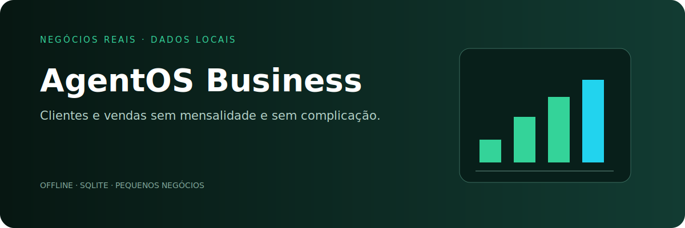

# AgentOS Business Toolkit

Kit offline e portátil para pequenos negócios registrarem clientes e vendas em SQLite, sem mensalidade ou nuvem obrigatória.

```bash
python business.py cliente "Cliente Exemplo" --telefone "(00) 00000-0000"
python business.py venda 1 "Serviço" 150.00
python business.py venda 1 "Material escolar" 280.00 --vencimento 2026-08-10
python business.py pendentes
python business.py receber 2
python business.py clientes
python business.py vendas
python business.py resumo
python business.py exportar vendas.csv
```

Agora controla vendas pagas e a prazo, vencimentos, atrasos e recebimentos. O resumo separa total vendido, recebido e a receber; a exportação CSV inclui status e datas. Bancos existentes são atualizados automaticamente sem perder registros. Os comandos usam parâmetros SQL seguros. Por padrão, os dados ficam em `~/.agentos_business.db`. Projeto AgentOStudio · Licença MIT.
